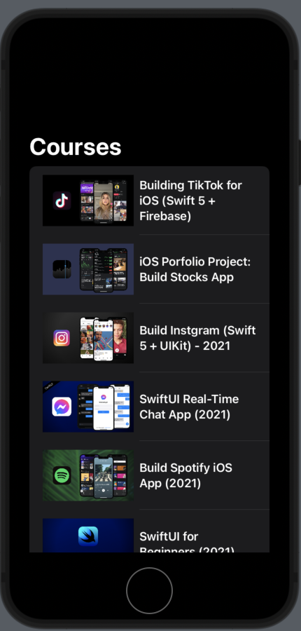

Currently Working on this Project for Backdrop Build v4


Followed this [tutorial playlist](https://www.youtube.com/playlist?list=PLwvDm4Vfkdphl8ly0oi0aHx0v2B7UvDK0) to build the base application with swift and firestore

Schema as of May 28

```
user {
    id
    email
    activities[]
    isPremium
    Activity {
        name
        progress
        dateLastUpdated
    }
}
```


Followed this [tutorial](https://youtu.be/CimY_Sr3gWw?si=hKqj16K6xAqJ42tz) to get API calls to work

```
App Progress {

    class Activity {
        Name
        id
        Calendar {
            which days completed
            streak counter
        }
    }
}
```


